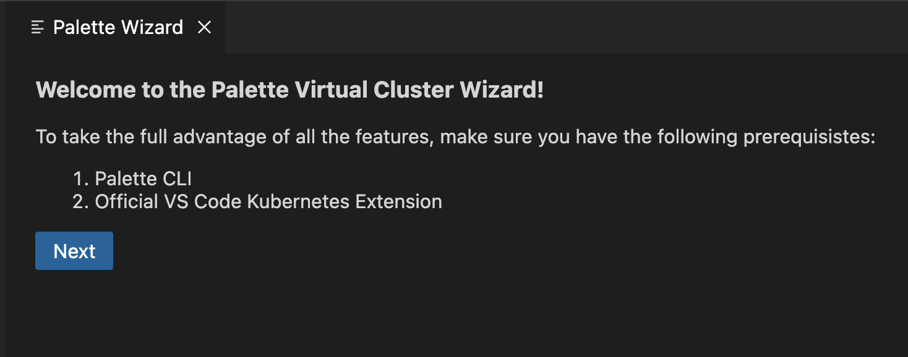

# PDE Extension for Visual Studio Code

The [Palette VS Code Extension](https://marketplace.visualstudio.com/items?itemName=SpectroCloud.extension-palette) with the [Palette CLI](https://docs.spectrocloud.com/palette-cli/) tool provides a fast and easy way to  spin up Kubernetes virtual clusters using the [Palette Dev Engine](https://docs.spectrocloud.com/devx/), while  seamlessly integrating with the official [Kubernetes extension](https://marketplace.visualstudio.com/items?itemName=ms-kubernetes-tools.vscode-kubernetes-tools) to make developing and testing apps on a Kubernetes cluster easy for a developer. 

## Requirments
The PDE plugin requires the following requirements to be met:
- Palette account and an API key
- PDE CLI installed locally

Optionally, the following requirements should be met if you want to spin up the clusters in your self-hosted Cluster Groups:
- Host cluster setup within Palette
- Cluster group created

## Quick Start

Spin up Clusters using [Palette Dev Engine](https://docs.spectrocloud.com/devx/) with VS Code in three steps:

- **Step 1:** If you haven't done so already, install [Palette CLI](https://docs.spectrocloud.com/palette-cli/) and have it available in your PATH.

- **Step 2:** Install the [Palette PDE Plugin](https://marketplace.visualstudio.com/items?itemName=SpectroCloud.extension-palette).

- **Step 3:** To activate the extension, simply press `Cmd + Shift + P`(on mac)/`Ctrl + Shift + P`(on windows) in any open any folder or VS Code workspace to open the command palette. From the command palette, search `Palette: Open Wizard` to launch the cluster creation wizard.

Optional Step:

- **Step 4:** Install the [Kubernetes Extension for VS Code](https://marketplace.visualstudio.com/items?itemName=HashiCorp.terraform).

Installing the Kubernetes Extension for VS Code is not compulsory, but it helps with deploying pods on the virtual clusters after they are up and running. It provides a file tree type UI to access the various components of the Kubernetes cluster (deployments, pods, services, etc..) and also helps with using `kubectl` commands (applying a manifest.yaml file, creating port-forwards, etc. ) from inside VS Code. If you do not want to use the Kubernetes Extension for VS Code, you can always use `kubectl` from the terminal window to interact with the virtual clusters.

See [Kubernetes Extenison Integration](#integration-with-kubernetes-extension-for-vs-code) for more detailed information on how to use the Kubernetes Extension for VS Code in conjunction with the PDE extension for VS Code.

## Features
- [Authentication](#authentication) To authenticate a user, you have to enter your Palette account API key, as well as the console URL to which you want to login. 
- [Create](#create-new-virtual-clusters) Spin up a new virtual cluster using palette dev engine in a few easy clicks.
- [Download Kubeconfig](#download-kubeconfig) Download the Kubeconfig.conf file of the virtual cluster selected, to be used with `kubectl` in the command line or with the Kubernetes VS Code Extension.
- [Delete](#delete-virtual-cluster) Delete the selected virtual cluster.
- [Resize Virtual Cluster](#resize-virtual-cluster) Specify the values to be used to resize the selected virtual cluster.
- [Pause ](#pause-virtual-cluster) If the virtual cluster is not being used for a while, you can pause the virtual cluster, reducing the resources being used by your account. 
- [Resume](#resume-virtual-cluster) Resume a paused virtual cluster to bring it back into running state.
- [Change Projects and Cluster Groups](#change-projects-and-cluster-groups) You can select from the available projects and cluster groups in the dropdown to deploy your virtual clusters in.

### Authentication
Once you click the `Next` button from the home page, you are prompted to input your login credentials if you haven't logged in before. If you have logged in previously, clicking  on the `Next` button will take you to directly to the cluster details page. If you want to change login credentials after you have already logged in, simply click on the `Change API Key` button to take you back to the login page.

To Login, you have to enter your palette API key as well as the console URL, to which you will be logging in. If you have a self hosted palette solution, your console URL might be different than "https://console.spectrocloud.com/".

https://github.com/Vivek-Joshi-99/Palette-Extension/assets/46157461/449868e1-b4f8-45b7-9fe6-4145a9c8af4e

### Create New Virtual Clusters

Once you are in your desired project and cluster group configuration, click on the `Create New Virtual Cluster` button to open the cluster creation page. Here, you will be asked details about the virtual cluster like it's name, required CPU cores, Memory(in GBs) and Storage(in GBs). Once you have filled the required details, you can click on the `Create Cluster` button to spin up your new virtual cluster.

> **Note:** If there are validation errors present in the input upon pressing the `Create Cluster` button, the virtual cluster will not be created and message describing the relevant errors will be show.

https://github.com/Vivek-Joshi-99/Palette-Extension/assets/46157461/c3b83c2b-ff07-41f8-ba1d-b8b34a3790df

### Download Kubeconfig

The extension provides a way to download the Kubeconfig file for the virtual clusters. 
To download the Kubeconfig, simply select a virtual cluster for and click  on the `Download Kubeconfig` button. This will download the Kubeconfig of the required virtual cluster and display the path where the downloaded Kubeconfig file is stored.

#### Integration with Kubernetes Extension for VS Code
This downloaded Kubeconfig file can be used to register the virtual cluster with the Kubernetes Extension for VS Code, to explore the components of the cluster in a file tree type UI and to apply `kubectl` commands form inside VS Code using the UI provided.
After the Kubeconfig is downloaded, a file selector menu from inside VS Code is launched if you have the Kubernetes Extension installed. Here, you can specify the path to the downloaded Kubeconfig file to register the virtual cluster with the Kubernetes Extension.

https://github.com/Vivek-Joshi-99/Palette-Extension/assets/46157461/8df7b127-404e-4e4d-8578-1ade817555f3

> **Note:** The usage of the Kubernetes VS Code Extension is beyond the scope of this project. To look at how to use the VS Code file explorer view and apply `kubectl` commands from inside VS Code, please look at the [docs](https://code.visualstudio.com/docs/azure/kubernetes) of the Kubernetes Extension for VS Code.

### Delete Virtual Cluster

The extension can also be used to delete virtual clusters. After selecting the required virtual cluster, simply click on the `Delete` button to delete the virtual cluster. A pop up will appear asking you to confirm your decision. Click the `Yes` button in the popup to confirm your decision and delete the selected virtual cluster.

https://github.com/Vivek-Joshi-99/Palette-Extension/assets/46157461/e625342d-9494-4dff-9eee-9071c2c9f083

### Resize Virtual Cluster

You can select a virtual cluster and click on the `Resize` button to launch the resize virtual cluster page. Here, you can specify the new number of CPUs,Memory(in GBs) and Storage(in GBs) that the cluster should be resized to. After you have assigned the new values, you can click on the `Resize Cluster` button to resize the selected virtual cluster.

https://github.com/Vivek-Joshi-99/Palette-Extension/assets/46157461/7ad36229-1b90-4666-9a23-4acf028da21f

### Pause Virtual Cluster

You can select a virtual cluster that is in the running state, and click on the `Pause` button to pause the virtual cluster. The virtual cluster gets paused and does not use any resources in this state.

https://github.com/Vivek-Joshi-99/Palette-Extension/assets/46157461/6f9a8fd8-7a81-4228-b3a3-ec167059f134

### Resume Virtual Cluster

You can select a virtual cluster that is in the paused state and click on the `Resume` button to bring the cluster back into a running state.

https://github.com/Vivek-Joshi-99/Palette-Extension/assets/46157461/b448d63e-2232-4d92-bb11-a92b125900fe

### Change Projects And Cluster Groups
The extension lists all the available projects and virtual clusters available to your account (associated with your api key) as a drop down. To change between different projects or cluster groups, simply select the desired option from the dropdown provided.

https://github.com/Vivek-Joshi-99/Palette-Extension/assets/46157461/39f4fda4-1f6b-4812-a8fd-8903e6c2b220

## Debugging
To debug the extension in your VS Code environment, complete the following steps:
* Clone this repository.
* Open the cloned repository in VS code.
* Run npm install in the project repository
* Press `f5` to open a new vscode window in the debugging environment with the extension already installed.
